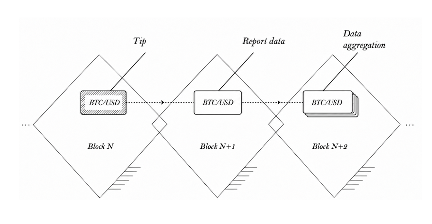
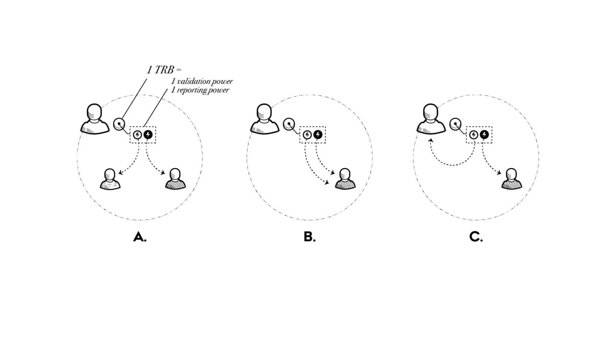
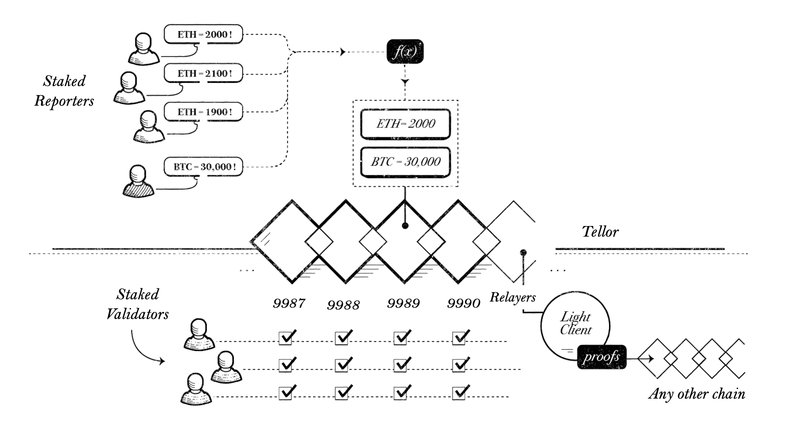

**Tellor**

**_Last Edited:_** _11 Aug 2026_

Table of Contents

[Introduction](#introduction)

[How the Chain Works](#how-the-chain-works)

* [Submitting Values](#submitting-values)

* [Cycle List](#cycle-list)

* [Disputing](#disputing)

* [Validator penalties](#Validator-penalties)

* [Tipping](#tipping)

* [Validator Set Dynamics](#validator-set-dynamics)

* [Dual Delegation - Reporting vs Validating](#dual-delegation---reporting-vs-validating)

[Tokenomics](#tokenomics)

[Bridging](#bridging)

* [Updating the Validator Set](#updating-the-validator-set)

* [Tellor Token Bridge](#tellor-token-bridge)

* [Data Bridge](#data-bridge)

    * [Signing Prices](#signing-prices)

    * [Relayer](#relayer)

    * [Relay fallback](#relay-fabllback)

    * [Other cross-chain methods](#other-cross-chain-methods)

[Data Usage](#data-usage)

* [Robust Data Usage](#robust-data-usage)

* [Edge Data Usage](#edge-data-usage )

[Additional data security](#additional-data-security)

* [Dispute Monitoring](#dispute-monitoring)

* [Optimistic as Fallback](#optimistic-as-fallback)

* [Additional Self-Driven Security and Fallbacks](#additional-self-driven-security-and-fallbacks)

[Fork Choice](#fork-choice)

* [Soft Upgrades](#soft-upgrades)

* [Hard Forks](#hard-forks)

[Plan for legacy Tellor contracts](#plan-for-legacy-tellor-contracts)

[Conclusion](#conclusion)

[Glossary](#glossary)

[Footnotes](#footnotes)

# Introduction

From the initial deployment in August 2019, Tellor has been designed so that no trusted party can prevent users from requesting, reporting or disputing data. Today we continue with the same principles: permissionless validators, reporters, disputers, relayers and users. Anyone can become a validator or reporter via staking, dispute for a fee, get any data by tipping it, and relay the openly available data attestations on Tellor, without the team's intervention. Crypto economic incentives have been in place since inception as we have focused our efforts on being decentralized and secure. Tellor's design supports data liveness guarantee which is only possible because the design allows the protocol to survive even if the team disappears[^footnote-1].

Every aspect of Tellor is open source including consensus, bridging, reporting, and relaying so that everyone can audit and participate in the network as validators, reporters, users, and holders.

Throughout the protocol, architecture decisions prioritize censorship resistance, open participation, and security over speed. Slow unstaking, delayed withdrawals, dispute windows, dispute rounds, configurable user by user trust assumptions such as fallbacks, consumer side validation and choice of relay all aim to reduce systemic risk.  
 Tellor provides a flexible foundation for users to choose how they consume our data. Users can control how much validation, delay, monitoring or redundancy they require and even layer their own governance or additional security.

# How the Chain Works

Tellor is a stand alone L1 built for the purpose of coming to consensus on any subjective data. It works by using a network of staked parties who are crypto-economically incentivized to honestly report requested data.

## Submitting Values

Any staked reporter can submit a value for a given query (i.e. data request, e.g. BTC/USD price). All queries have a report time frame. For that given time period, reporters can add their value to the array of submissions. At the end of the time period, the official value is determined by a weighted aggregation of all the values submitted.

All queries have an aggregation type associated with it (e.g. median, mode, average, etc.)[^footnote-2]. Once the time frame ends, the reports are subject to weighted aggregation. For this reason, larger reporters contribute more to the official value than smaller ones. Each official value takes a minimum of three blocks (target time 2s per block). The first block is the tip (e.g. "I request BTC/USD"). The second block is the reporting and the third is more reporting and aggregation phase, where all values are submitted and then aggregated, at which point an official value is determined for the query. Tips are distributed to all reporters for a given query using their weighted contribution.

Figure A: Tellor process from Tip to Data Aggregation.
 

The reporting time frame begins once a queryId is tipped. All reporters can add their value to the submission array for inclusion in the aggregation and for distribution of the rewards.[^footnote-3] Tips received within the time frame are added to the initial tip. If no reports are submitted during the time frame, the time frame is restarted upon the next tip and the original tip is added to the new tip for that queryId.

## Cycle List

In order to maintain freshness, the system maintains a list of enshrined queries, a _cycle list_. Reporters continuously report for the next query in the list to ensure that tips do not need to be submitted in previous blocks to have a base level of reporting (thus avoiding wasting gas by validators who just want inflationary rewards). This signals reporters what to report so they act in unison and contribute as much aggregate power to a single report as is available. Reporters are never required to report for any queries including those in this list, but as long as inflationary rewards are enough to cover the gas costs of reporting, some query from the cycle list should be reported to consensus every block. Cycle list changes are voted on by governance.

To incentivize consistent reporting across **all** cycle list queries, TBR distribution uses a per-aggregate power share approach. Instead of distributing TBR immediately per aggregate, rewards are accumulated over a configurable period and distributed based on each reporter's power share within each aggregate.

## Disputing

There are some differences in disputes from legacy Tellor but what has not changed is that the entire dispute and resolution mechanism is done on chain with transparent slashing and with earning successful disputers earning the majority of the slash amount. This mechanism continues to incentivize everyone to run a disputable values monitor and to compete to be the first to dispute. Also, the user does not have to wait for resolution, instead if the value was the median the value is flagged and removed, and they can use the next available value. Similar to the old Tellor system too, is the idea that since you can censor a party by disputing, disputes can be seen as a wager on who is correct (the reporter or the accuser).

What is different is that reporter stakes are not tied to specific values, but rather to a given reporter. For instance, a reporter can submit ETH/USD once every second with their same stake. If they submitted a bad value 2 days ago[^footnote-4], they can still be subject to a slashing event. Any party can raise a dispute with free floating TRB, but unlike the old system, reporters and validators can use their stake (or part of it) to begin a dispute. Once initiated, the dispute fee and the potential slash amount (from the accused reporter) are put in escrow and removed from corresponding staking powers.

To initiate a dispute, the disputing party submits a dispute against a given reporter for one of three categories:

- Warning (dispute fee is 1% of stake) - jail[^footnote-5] with no minimum time lock, can call a function to be released from jail and begin reporting again
- Minor Infraction (dispute fee is 5% of stake) - jailed for 10 minutes and out when they call the release from jail function
- Major Infraction (dispute fee is 100% of stake) - jail until dispute over (since 100% of stake).

A release function has to be called after a warning or minor infraction to ensure the staker has looked at the dispute and implemented a fix as necessary. Infractions in these lower two tiers can generally be assumed to not be malicious.

After specifying the dispute category, the disputer submits an amount of TRB up to the minimum slashing amount before the dispute can initiate. If they don't have enough funds themselves, for up to one day, others can add to the pot until they hit the slashing amount (i.e. 1, 5, or 100 percent depending on the slashing category). Once the amount is hit (could be hit instantly upon proposing the dispute, or could take up to a day), the potential slashing amount will be taken from the disputed validator and placed into a locked stake.

For up to two days, stakeholders will vote on which side of the dispute they support. Tellor uses a different voting distribution[^footnote-6] from the legacy Tellor governance. Previously, voting power was evenly distributed among users, reporters, token holders and the team. However, because most TRB on Tellor is expected to be either staked or used for tips, the voting distribution is split among these three groups:

33.3% users (tips)

33.3% reporters

33.3% team

When reporters vote they vote with the backing of all the TRB that was delegated to them. However, the selectors (TRB holders that selected a reporter) can independently vote for the dispute and overwrite the reporter's vote for their voting power. Holders can help increase the security of Tellor by delegating to validators and selecting a reporter as this will allow them to participate on dispute votes.

Once the two days are over there is a one day period where the dispute can be reopened and the same two day voting round is repeated. However, if at any point a quorum of >50% total voting power votes in favor of one side of the dispute, the dispute is considered finalized and no new rounds can be opened.

Once the dispute is resolved, the stake from the losing party is transferred to the winning party(ies) as undelegated, staked TRB. Tokens disputed or used as fees in disputes are not released as free floating tokens so as disputes cannot be used as a way to exit staking faster, however if free floating tokens are used to pay the fee, they are returned as free floating tokens in the case of a successful dispute.

Note that each dispute round (even the initial one) takes 5% of the dispute fee. Of that 5%, half is burned and the other half is divided amongst voters in the system. The dispute fee then doubles each round **up to the slash amount** to further incentivize voting and to prevent spamming. Once quorum is reached on a dispute, further dispute rounds cannot be raised.

For usage purposes, values are not attested to if the disputed reporter was the official aggregated value (median contribution). Values that need to be flagged are also added to evidence when the dispute is initiated (an array of values). For this reason, users who rely on optimistic finality should be aware of dispute censoring attacks and the potential for values to take time to get through.

Tellor's on chain dispute mechanism, resolution and slashing allow it to be a preventive measure as well as a proactive one. Slashing helps deter attackers while also economically incentivizes anyone, including the user to be proactive in disputing before the data is ingested by a protocol. After the fact disputes are also allowed, however, the incentivized preventive and proactive approaches are preferred and properly incentivized since once the data is ingested, damage could be irreversible.

## Validator penalties

Validators have normal cometBFT liveness and double-signing penalties, which are handled automatically by the chain. Additionally, Tellor applies slashing for malicious attestations and malicious validator set update signatures. This is done by manually submitting evidence of these behaviors.

| Standard cometBFT penalties                     | Additional Tellor penalties                            |
| ----------------------------------------------- | ------------------------------------------------------ |
| Liveness (15 minutes of inactivity) slash is 1% | Malicious attestations are slashed 1% of stake         |
| Double-sign slash is 5%                         | Malicious validator set update attempts are slashed 5% |

## Tipping

All tips are done in TRB. Each query can be tipped directly and its tip will increase as more users tip it[^footnote-7]. Once a report is submitted and aggregated, 98% of the tip is split amongst reporters for that query in that given block. There is a 2% fee on the tips (to prevent vote farming/ spamming). This 2% fee is burned. Tips are distributed as locked TRB. Once locked, parties can run functions to claim the tip, in which the tips are unlocked and added to their stake or to tip balance ('MsgWithdrawTipToBalance') which will start the clock to unbound these in 21 days. This is to ensure that parties cannot bypass validator deposit limits through tipping, as well as to prevent farming vote power via the tipping mechanism.

Note that tipping consists of only one time tips. There is no built-in heartbeats or price thresholds because the complexity added is unnecessary and better handled off-chain (e.g. AI agents, or tip bots like the autoTipper and relayer handle this functionality already).

## Validator Set Dynamics

Chains using the tendermint consensus mechanism have a limited number of validators. By setting the number of validators, this allows for efficient interconnectedness between chains as well as faster throughput. The tradeoff that any chain must consider is that more validators leads to slower blocktimes and more expensive bridging costs. Tellor has started with a limit of 100 validators but will move to a larger set as technological advances or market conditions allow (e.g. if no one needs sub-2 second blocks).

The validator set can only change by a maximum of 5% per 12 hours including tip claims. This is for purposes of maintaining a stable validator set for bridging efficiency. Once the 5% change is hit, new validators will need to wait until the rolling percent change per 12 hours is under the cap. This 5% is a parameter that can be changed via governance.[^footnote-8]

## Dual Delegation - Reporting vs Validating

Tendermint uses a delegated proof-of-stake(dPoS) model where there is a set number of validators, but all token holders can delegate to validators to increase security and share in rewards. Tellor uses this delegation but adds a second delegation for reporting duties, which we refer to as **selecting**. Each token can be used as a stake for reporting and for validating. Parties can delegate both the reporting and validating to the same party, to different parties, or even to themselves. The same token is subject to slashing by either method (reporting data or failing to honestly validate the chain) and the stake balance for both delegations is reduced immediately upon either consequence, so great caution should be taken when delegating and/or selecting.

Figure B: Dual delegation

 

_Note: The delegated validator and the selected reporter can be different(A), the same(B), mix of yourself and others(C)._

The reason for this dual delegation is that validator sets are capped in tendermint based systems, however we need to remove that cap to enable smaller and more reporters to help decentralize the data provider set. Additionally, the cost of bridging is directly tied to the validator set size (verifying signatures for the light client bridges), so a large validator set such as Ethereum is unfeasible for our intended uses (the need for fast, cheap bridging of data).

# Tokenomics

TRB is the native currency of the chain and used for staking, tipping, dispute fee and voting. All tokenomics will remain the same (as it is hardcoded and cannot be changed). Four thousand tokens will continue to be the dev share to the team each month and an equivalent amount of tokens will be distributed to reporters and validators as inflationary rewards. Seventy-five percent of time based rewards go to reporters with the other twenty-five percent are given to validators.

Gas fees go to the block proposing validator (selected randomly by validator weight), while tips and inflationary rewards to reporters are distributed proportionally to the reports submissions based on weighted validator support. As an example, if a query is submitted for and gets 50% of the stake contributing to the aggregated value, this report gets some inflationary rewards, however if a more supported query gets submitted for with 100% of total stakes reporting for it, this gets 2x the rewards as the first value. There is no benefit being the only reporter for a query, unless of course there are tips that support that query over others. Additionally, to prevent tips on queries that only a handful of reporters support, time based rewards are only available on cycle list queries.

The goal is to get broad support among as many queries as possible without either incentivizing parties to report things that no one needs (e.g. report an obscure query that only one reporter supports) or disincentivizing reports of new queries. Tips are still, and should, be used as the primary incentive mechanism used to garner support for a given query.

# Bridging

## Updating the Validator Set

The bridge was initialized with a starting validator set. Whenever the Tellor validator set changes by 5%, all validators sign this new validator set checkpoint. This 5% threshold helps limit bridging costs as updating the validator set in the bridge contract costs gas. These signatures are used to update the bridge's record of the validator set, and any new data proofs do not pass the bridge's checks until the new validator set is relayed. Like data proofs, the bridge accepts a validator set update if at least ⅔ of the last known validator set signed off on it.

## Tellor Token Bridge

The Tellor token is interchangeable between the current ERC20 TRB contract on Ethereum and the base token TRB on Tellor. It is secured by a two way bridge, operated by Tellor itself via a light client bridge.

Bridging TRB from Ethereum to Tellor takes 13 hours. Once the deposit is made, Tellor reporters can report this information to Tellor for an hour (to allow for a high level of finality on Ethereum). Once that one hour window is closed, the deposit can be claimed 12 hours later on Tellor. A party bridging TRB to Tellor for the first time will not have TRB available on Tellor to pay the required gas fee to claim the deposit so deposits are automatically claimed after the waiting period (12 hours).

In order to prevent attacks, withdrawals from Tellor can only be done if unstaked from being a validator on Tellor (which requires 21 days). Once a withdrawal is initiated and attested to by validators, it can be retrieved on Ethereum 12 hours later. As an additional security measure, the bridge contract does not allow more than 20% of the bridge balance to be bridged to Tellor and 5% from Tellor to Ethereum within a 12 hour period (the function is locked). We have prioritized security over speed on the token bridge.

Staking is still growing on Tellor chain and the cost of capture increases as staking grows. To allow safe growth, anyone in the community that suspects Tellor chain has been compromised can propose a bridge pause by paying 10,000 TRB which will be burned if the pause is approved by the team's multisig(this permission can be removed). Once the chain is forked, the community can slash the malicious actor and compensate the pause proposer. The bridge can be unpaused after 21 days by anyone. It's worth noting that even if the token bridge is paused, data can still be produced by the chain as consensus and rewards happen on the chain.

## Data Bridge

Tellor can be used as a push or pull oracle and both implementations require validation of Tellor's validator set via light client bridge contract. A light client bridge is needed on each chain and parties relay the requested data and signatures as well as information related to validator set updates and chain upgrades. Anyone can deploy a light client bridge contract and **relaying** is a trustless and permissionless role, meaning that anyone can push validator signatures from Tellor to validate data on the data bridge contract. However, additional, access controls can be put in place at the chain or user contract level by the user.

### Signing Prices

Once a value is aggregated (finalized in a given block), all validators sign the information. The resulting signatures allow users to access the value, timestamp, aggregate power (amount of reporter stake used in aggregation), previous report timestamp, and next report timestamp of a given query. The previous report timestamp and next report timestamp by queryID are included for proving various properties of a given report.

Where: _data = value, timestamp, aggregatePower, previousReportTimestamp, nextReportTimestamp_

Validators will: _sign( queryId, data, validatorCheckpoint, attestationTimestamp )_

Parties using Tellor can then grab the signatures and relay it to their chain.

Users can also request new signatures for data from previous blocks, (e.g. request(queryId, timestamp)) and the chain will return signatures on the older data, but with a newer attestationTimestamp. This is so parties can use values optimistically, by checking that the data has stayed on Tellor for a certain amount of time without disputes, as data that has been disputed will not be signed again.

### Relayer

The relayer (pushing signed data from Tellor to user chains) can be done by **anyone**. We provide software for relaying values and tipper scripts for setting up recurring feeds. Many keeper services also could fill this role (Keepr, Gelato, etc.).

### Relay fallback

If there are no updates to a given light client bridge for >21 days (the unbonding period on Tellor), then the bridge is considered stale, a situation where it needs a manual update of the validator set. To address this, the light client bridge includes a function for a guardian to be able to update the validator set manually after 21 days. Anyone can deploy the light client bridge and set themselves as the guardian or remove that capability. There can be multiple light client bridge contracts on a chain. For most use cases, missing data for more than 21 days would be a severe failure condition and should trigger the users to relay themselves (unless the users or the chain are dead or some other extreme event has occurred, in which case, the guardian becomes immaterial).

The Tellor team will deploy light client bridges with the team's address as a fallback that can update the validator set but users are not required to use these (these will act as a public good). If parties do not want it to fallback to the team, they can simply update the validator set before the 21days or deploy a light client bridge where it falls back to a different address (or remove that functionality).

###

### Other cross-chain methods

We know that some parties already have existing bridge solutions that they prefer. Tellor data can be used via any of these solutions and we look forward to building and working with the teams to deliver the fastest and most secure solution for users. Some potential usage solutions include IBC, Hyperlane, Succinct and many more.

In the future, it is likely that native or zero-knowledge bridges will be used to verify signatures, consensus, as well as inclusion of values. Tellor will be leaning on other teams currently specializing in cryptography research, but we fully expect that all bridges will be cheaper and faster using this method and should be operational within the next cycle.

Figure C: Tellor process of aggregation, attestation, and relaying data to other chains.

Note: Staked reporters, staked validators, users and relayers, and data monitors are all permissionless roles.

# Data Usage

Reporters are not required to provide data for all queries. This creates two types of data on-chain, _robust data_ and _edge data_. Robust data is data that reaches consensus or support from ⅔ of the reporters and validators, while edge data can be any data that did not. While confidence on both types of data increases as time goes by (no disputes or forks in the case of robust data), they have to be used differently.

## Robust Data Usage

If ⅔ of Tellor reporters sign off on a value, it is considered robust (aka consensus data) and it can be consumed faster. A relayer will grab the desired data and signatures and push it to the consumer chain. Parties can then use the information in their protocol. There is no need to validate it any further, however waiting could be helpful, if only in extreme cases (e.g. large price moves), to check for forks, or widespread dispute conditions (e.g. a protocol or exchange failure/hack where api information may not properly reflect desired data specifications). In most cases however, this method will allow for updates as fast as the chain itself.

Robust data can be consumed instantly only if it is assumed that the Tellor validator set is not compromised (signed off on bad data to the bridge or in the chain). However unlikely it is that the validator set would be compromised we advise implementing some precautions when using the data immediately. Users can run or whitelist relayers on their contracts and/or run monitoring tools, not allow immediate withdrawals, system freezes, etc. as necessary. See the **Additional Self-Driven Security and Fallbacks** section for more information.

## Edge Data Usage

Similar to robust data usage, parties request signatures and relay data from Tellor. However, edge data (aka optimistic data) should be handled optimistically, meaning that the user should allow time for a dispute to be raised and before using the data validate that the timestamp returned is within the needed period of relevance (old enough to allow for disputes but fresh enough to use). They can either use an older value (similar to current Tellor), and/or verify that X% of validators signed off on it.

# Additional data security

## Dispute Monitoring

Dispute monitoring is beneficial for both robust and edge data. However, this is especially important when parties are using edge data; they must be cognizant that the system is only as secure as the monitoring for disputes. If, for instance, a party requests an obscure piece of data that only one validator reports for, and their stake is low, there will likely be few parties checking this query for disputes. This is why if using an edge value, adding extra security is essential[^footnote-9]. Running your own dispute monitor, educating more reporters to support it, or even more secure measures such as using only if the median is within x% of a given (e.g. their own team's) reporter.

Successful disputes earn the majority of the slashed amount of the disputed party so there is also an economic incentive for anyone to run a monitor[^footnote-10].

## Optimistic as Fallback

If consensus fails on certain values that are typically robust, parties have two choices: wait for consensus to return or handle the edge value, optimistically as specified above. This could be a great option for some parties using data where quality can quickly change. A price feed for example might not come to consensus in times of api failures or exchange manipulations (e.g. feeds go down). In this case, it might be best to pause the system, but they could also go with the optimistic approach if their protocol needs a faster (albeit still slower than consensus) price. Note that in most cases, an uncertain value would NOT be pushed to your protocol. Tellor is unique in that rather than forcing reporters/validators to sign off on an api or price feed, the addition of their value is optional. This means that if a reporter is not certain it's a valid value, they will likely just sit out that round(not risk their stake or part of it) and the value will not reach consensus; something that should be seen as a good thing in cases where ambiguity still exists (e.g. two exchanges differ wildly on price).

## Additional Self-Driven Security and Fallbacks

Although security is at the center of Tellor's design, consumers of Tellor data can add custom additional security. Manipulation attacks should always be considered by users. There are many examples where using the oracle value immediately has led to exploits or unintended consequences.[^footnote-11] **Data manipulation attacks are oracle agnostic** and have occurred even when the oracle was centralized. But users can implement user level controls to mitigate losses and even dissuade attackers. One of the bigger players[^footnote-12] in the crypto space includes pauses, delays throughout their system, a one hour delay before using the oracle value, debt ceilings and other governance delays. They are proof that you can become a big player and be responsible.

Monitors, delays and pauses are useful because if the oracle is compromised in any way it allows users to react: overwrite, update the databank address, get a governance vote in, etc... However unlikely the scenario, users can implement controls to protect themselves and their users if the data is manipulated directly or by compromising the data provider/node, validator or reporter set.

One way is to simply limit who can push prices/ state updates on the consumer chain. By adding validation at this level, chains could use either their own validators or stakers to push over the prices after validating them. This would be an excellent option for users with this level of ownership over their protocol.

An option for non-chains via the low latency model would be to add validation before a trusted party (e.g. the app's dao) pushes the data. It gives the trusted party an option to censor, but they would be unable to change what the price is, something that would work similarly to a multisig having pause authority/control over a protocol. Users can also do OEV limits this way (relayer is a known party or even auction off the right for OEV[^footnote-13] each day/month).

Another option to increase security is consumer side pauses and delays. Pausing the system could be similar to the Maker design, where token holders of their own system can freeze the system in the case of a bad value[^footnote-14] or trust a curator or committee (multisig) to do it for them. For delays, parties could just design a system where the oracle value is used after X amount of time or it costs X dollars (a large amount) to delay the use of a reported value. While delayed, they could initiate a dispute on the Tellor system to remove a reporter or evaluate the situation. This would work well for systems that can handle delays (e.g. a prediction market delaying payouts). Just note that this would be on a per-user basis and custom as the cost to dispute/pause is also the cost to censor if it freezes the system for certain protocols.

Users can also add disputes directly in their protocol similar to Tellor's disputing system, but can be handled by their governance. This would work well if coupled with custom staking requirements for reporters and could also be added as the "trusted" party that the Tellor value must match. A user side based dispute mechanism could also allow falling back to a more robust data feed such as going from a VWAP to TWAP before a governance vote. This works well if the protocol allows a grace period for their users to challenge data and they have a payout delay, since disputes are only useful before settlement.

For numeric data, implementing caps or thresholds on changes between the previous value and the incoming value can also help limit losses in an attack scenario or help trigger a payout delay or data challenge period. This types of volatility caps are on per user and data feed basis.

Users can use multiple oracle feeds and use the median of these similar to how Ampleforth architecture uses Tellor or as fallback similar to how Liquity V1uses a primary and Tello as a fallback oracle.

Multiple oracles, oracle fallbacks, data feed fallbacks, pauses, payout delays, oracle use delay, thresholds caps for changes, overwriting the oracle value[^footnote-15] or updating the oracle address are options that provide a high level of control and can be modularly implemented at the users' discretion. Many of these options are used and/or have been used by protocols. Determining what level of control is right for your protocol, if these should be controlled via governance, a curator, or mutlisig is up to you, the user (and always provide proper disclosures of these levels of controls to your users).

These options require a higher level of control and are optional. They add layers of security that is user driven based on their desired or required level of control and level of ownership over their protocol. Some of these controls are preventive while others allow users to be proactive in the event of a hack or manipulation event. Most of the blue chip crypto we see today was made possible because they grew in proportion with the industry. Bitcoin's and Ethereum's market caps were very low when they first launched and could have been easily captured and manipulated too. However, incentives to capture or hack a protocol will always exist when the cost of attack is lower than the gain. Newer protocols need an environment in which they can thrive and grow securely. They need to be treated differently than blue chip crypto assets. Blue chips are harder to manipulate and capture than low liquidity and emerging assets/protocols. Additionally, the user can choose to implement these guardrails temporarily or not(for most of these, removing the control could be as easy as throwing the controlling address or removing it automatically if a market cap, liquidity, stake amount threshold or a combination of these is surpassed).

# Fork Choice

Upgrades and forks to Tellor will likely happen. Upgrades in the form of better data aggregation techniques, changes to the consensus protocol(e.g. cosmos sdk updates for faster blocktimes), or even changes to the Tellor system to make it more secure. Hard forks on the other hand are security based and happen if the protocol is attacked, compromised, or broken in some way.

## Soft Upgrades

For each chain using the Tellor protocol, we can have a mapping of chainID to a valid contract address for the verification of the data/protocol. In order to change it, a new light client bridge contract with the updated code will be deployed on the EVM chain. Validators will then update the mapping, and propose a change on the consumer chain. Then after waiting 14 days (allows for users to exit if malicious), the address will be updated to the new validator contract.

## Hard Forks

For hard forks, you will also have a way to update this proxy address for verification of the consensus mechanism. The issue here is that time is of the essence. If the validator set is compromised or a bug is found, parties will want to very quickly switch off the oracle and upgrade. Unfortunately, the switch cannot happen quickly, but freezing should be possible.[^footnote-16]

# Plan for legacy Tellor contracts

Tellor currently has users on Ethereum, Polygon, Gnosis, Arbitrum, Mantle, zkEVM, zkSync, BOB and Optimism.

Tellor contracts are immutable, so users of the contracts can continue to use the contracts as they do currently. Users need to continue to incentivize reporters to stay on other chains posting data (tip) and should migrate over time as they upgrade their contracts or launch new systems.

The current TRB token contract remains the same, on Ethereum. But instead of minting the time based rewards to the oracle contract it sends these rewards to the bridge contract. The bridge contract has an oracle proxy that allows legacy Tellor users to read data from Tellor (the light client contract).

The reason the oracle tokens are given to the bridge is to allow a two way bridge since inflationary rewards happens on Tellor based on the bridged tokens.

# Conclusion

Tellor is an open network where anyone can validate, report data, request any data, dispute data, and help settle disputes via staking and fees. These properties uniquely position Tellor for no friction integrations by users or AI agents alike[^footnote-17]. Tellor is crypto-economically secure with measurable security and users can layer additional security controls. There is no one way make protocols 100% immune to manipulation or capture but security can be layered to meet each users' needs.  
 Tellor's architecture aims to remain permissionless and censorship resistant but applications using it can choose to embody the same properties or add controls on top of it. This is similar to how applications on Ethereum can implement higher levels of control over their system without compromising Ethereum's properties.

## Glossary

1. **Tellor and Tellor Layer:** A standalone Layer 1 (L1) blockchain built using the Cosmos SDK, designed for consensus on subjective data using tendermint and an optimistic approach.
2. **Cosmos SDK**: A software development kit for building blockchains in the Cosmos ecosystem.
3. **Tendermint/ Comet BFT:** A Byzantine Fault Tolerant (BFT) consensus algorithm used by blockchains in the Cosmos network.
4. **Validator:** An entity in the Tellor network that has locked a certain amount of TRB tokens to participate in block validation.
5. **Reporter:** An entity in the Tellor network responsible for submitting values for data requests (queryIDs). Reporters can be staked validators or other participants, depending on the network's rules. They provide data, incentivized through tips, subject to validation and potential disputes.
6. **Query:** A unique identifier for a data request (e.g., BTC/USD price) on the Tellor.
7. **TRB Token:** The native cryptocurrency of Tellor, used for staking, tipping, and governance.
8. **Cycle List:** A governance-controlled list of queryIDs to maintain data freshness and ensure continuous reporting.
9. **Consensus Threshold:** The minimum amount of agreement required among validators for a value to be considered valid.
10. **Disputing**: A process in Tellor where reporters' submissions can be challenged, potentially leading to slashing of their stake.
11. **Slashing Event:** A penalty where a portion of a validator or reporter's stake is removed due to submission of incorrect data or other violations.
12. **Tipping:** A system where users can tip reporters in TRB tokens for submitting data for specific queryIDs.
13. **Relayer:** An entity that transmits data from the Tellor to other blockchains, facilitating cross-chain data accessibility and usage
14. **Robust Data Usage:** A data verification method in Tellor where values agreed upon by a supermajority of reporters are instantly deemed reliable for real-time use.
15. **Edge Data Usage:** A method of using Tellor where submitted values are presumed correct if not disputed over a period of time, and/or X% of validators signed off.
16. **Light Client Bridge:** A mechanism for relaying Tellor data to other blockchains.
17. **Validator Nonce:** A unique number used once by validators to prevent replay attacks.

## Footnotes

[^footnote-1]: This is an ultimate test of decentralization. But team and community contributors help ensure protocols evolve with the times and improve as new technology becomes available. 

[^footnote-2]: For prices and most numeric data feeds the aggregation method is the median this makes it more difficult and costly to manipulate and this can be customizable per users' specification. Additionally, off chain computation of more robust methods such as TWAPs or VWAPS can be done before submitting to aggregate on chain for the official value.

[^footnote-3]: The reason for this is that some queries are not automatic, e.g. "let's type in an answer manually", so we want to give room for non-time sensitive queries to get more reports. Spot prices and automated queries will have a report time frame of 1 or 2 blocks.

[^footnote-4]: Because of the competitive forces in Tellor, validators, reporters, users, and disputable value monitors(many of which are other validators and reporters) a reporter and bad value would be disputed almost immediately. Users and monitors can observe data real time on-chain for Tellor and dispute before it has the chance to get to their mempool and be subject to MEV and OEV. Transparency helps prevent our users from ingesting bad data because it does not wait until after the fact for disputes and slashing and has direct bounty to incentivize watchdogs/monitors.

[^footnote-5]: "Jail" is a concept in the tendermint system where the validator (or reporter in this case) is locked out of participating for a certain period of time

[^footnote-6]: Checkout our ADR 1008 on voting power by group for more information on why validators are not part of it <https://github.com/tellor-io/layer/blob/main/adr/adr1008%20-%20voting%20power%20by%20group.md>

[^footnote-7]: Users that need the same data feeds can crowdsource tips. On-chain tips make costs transparent and AI agents can interact with Tellor easily as they can request support for new data without needing humans to sign a contract.

[^footnote-8]: There is also a delay (21 days) to exit (the unbonding period).

[^footnote-9]: More information on Tellor's security can be found here: <https://tellor.io/blog/layer-security-201/>

[^footnote-10]: An open-source disputable values monitor is available

[^footnote-11]: Take for example Elixir protocol, now defunct, in 2025 jaredfromsubway.eth made a trade in a Curve pool on Ethereum of 210K USDT for deUSD, the oracle was providing a VWAP and this trade caused a change and the new value was reported to Euler on Avalanche where it caused a \$532K liquidation. Unfortunatley neither the user or the oracle had any data checks or variance thresholds check in place. This was a reminder that when data that is collected and attested off-chain in subseconds without visibility or dispute mechanism will still end up in the mempool subject to MEV or OEV and the user has no ability to stop it. That was the tradeoff made, speed over risk mitigation. This was the beginning of the end for Elixir. More information <https://rekt.news/house-of-cards> and <https://x.com/omeragoldberg/status/1928149178862952604>(#footnote-ref-11)

[^footnote-12]: Sky (formerly MakerDAO) is one of the longest running DeFi apps and they still employ a one hour delay on their oracle updates. <https://developers.skyeco.com/security/security-measures/security-mechanisms/#oracle-price-delay>

[^footnote-13]: Oracle extractable value

[^footnote-14]: Depending on the type of data, this is a best practice for any system using an oracle 

[^footnote-15]: Hyperliquid validators overwrote and delisted \$JELLY when attacked last year. This works well for protocols with this level of ownership and fair disclosure to their users <https://rekt.news/hyperliquidate2> 

[^footnote-16]: A library such as: <https://github.com/RealityETH/subjectivocracy> can be used as a dispute resolution mechanism for freezing and then voting on the results of the fork (all very costly to initiate to prevent censoring). Ultimately, you want this to be decided by the users on the chain itself and it might be a good choice to have a permissioned set (w/ a high cost still) or even a re-staking situation. 

[^footnote-17]: Unlike other oracles, the team does not have to approve new data feeds or whitelist users or data reporters, instead AI agents can handle submitting a data specification to the community and tip to start getting data without the team intervention. 
