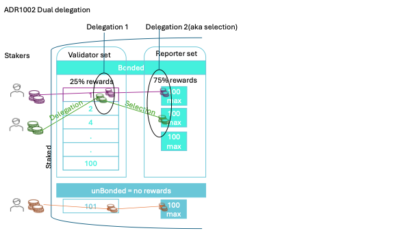

# ADR 1002: Dual Delegation

## Authors

@themandalore
@brendaloya

## Changelog

- 2024-02-21: initial version
- 2024-04-01: added clarifications on dual delegation
- 2024-08-03: Clarifications on selectors vs delegators

## Context

In layer, people can delegate their stakes to validators and reporters. To distinguish between delegation to validators and delegations to reporters, delegations to reporters are called selections and those making those selections, selectors.

Layer uses a delegated proof-of-stake(dPoS) model where there is a set number of validators but it allows for an unlimited number of data providers. Tellor Layer will allow token holders to delegate the same tokens twice but for two different purposes: 1)delegate to the top validators to share in validator rewards 2) delegate to data reporters for reporting duties and sharing tips and time based rewards. Each token can be used as a stake for reporting and for validating.  Parties can delegate both the reporting and validating to the same party, to different parties, or even to themselves, however, since validator updates occur in `EndBlock` and to maintain a consistent total power in the system, reporters are capped to have a max of 100 selectors, this is an arbitrary number chosen to be the same as the number of bonded validators and requires further testing, the limit is required in order to minimize the number of iterations that could happen since technically there isn't a limit to how many delegators a validator can have. Once a reporter reaches the max, a new selector becomes a reporter themselves (not required to report); and all selectors are able to move their stake to be with any reporter that hasn't reached the max number. The same token is subject to slashing by either method (reporting data or failing to honestly validate the chain) and the stake balance for both delegations is immediately updated upon either consequence.

The reason for this dual delegation is threefold:

    *  Validator sets are capped in tendermint based systems, however we need to remove that cap for reporters to enable smaller and more reporters to help decentralize the data provider set.  
    *  The cost of bridging is directly tied to the validator set size (verifying signatures for the light client bridges), so a large validator set such as Ethereum is infeasible for our intended uses (the need for fast and cheap bridging of data).  
    *  Reporting and validating are separate duties. Cosmos validators for the most part just run hardware and have little interaction with the chain. Running a reporter however is more resource intensive. You must maintain lists of API's, monitor for disputes, and help users make sure they're getting the best data on-chain. These roles should be separate so that each party can specialize.  

     

## Alternative Approaches

### Validators and Reporters are the same thing

Another discussed approach was that validators would be forced to be reporters. This is the most straightforward implementation of an oracle in the cosmos sdk. The benefit here is that tokens are not dual staked, but rather there is just one critical role for tellor. It also plays nicely in that all rewards are kept within the reporting ecosystem and validation can almost be seen as an addon. The downside here is that the set of reporters is limited to the validator set. For smaller queries, users would need to get support of a giant validator in order to get data on-chain. This could be prohibitively expensive. Many other chains do this, where they force validators to support each query. We wanted to avoid this for decentralization and robustness reasons (should your chain halt if people don't feel comfortable reporting? What if certain jurisdictions don't have knowledge of a given piece of information?).  

### No dual delegation - competing staking

Another option was to not allow dual delegation but would create two sets of participants that would compete for stake. This means that a token holder needs to decide to either validate the chain or report (or delegate to someone doing one or the other). The pro is that tokens are locked for their own specific purpose. The con is that validators and reporters are competing for rewards as a validator or as a reporter. This means that if your chain is more secure (when more token holders chose to be validators), each report is less secure (less value locked there).  

Token holders could also face a more difficult choice for delegation (what maximizes their profit, validator, reporter, a combination? what is the risk profile of each option?).

### Two token model

Another option briefly discussed was to implement two tokens, one for validating and one for reporting. Although it splits it in terms of the accounting pieces, the issue of where the value is driven is still the same problem as competing staking options. New buyers of TRB could be confused as to which one holds value and dynamics of where returns are driven is still largely interdependent in how the system mints rewards.  

## Issues / Notes on Implementation

Handling disputes here is particularly tricky. Making sure that the correct tokens are taken from the proper validator if a reporter is disputed must be handled correctly.  

The risks here are presumed to be separate, but it should be noted that they may not be.  This is a sort of "restaking" where value is being locked for two separate purposes. It must be monitored that reporting errors can affect the validator set and validator mishaps can affect the security of data reports. Bribes to overtake the tellor chain can now be two-fold also, where reporters OR validators could be bribed. This risk is known, however the interconnectedness of each party should help keep the system in check as both are necessary to keep the system functioning properly. Other restaking systems perform outside duties, whereas this dual delegation is more for role separation within the same system, with both pieces being necessary for the chain to be valuable.  

