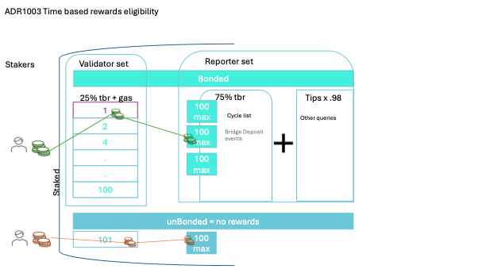

# ADR 1003: Time based rewards eligibility

## Authors

@themandalore
@brendaloya

## Changelog

- 2024-02-22: initial version
- 2024-04-02: clarity
- 2024-04-05: clarity/spelling
- 2024-08-03: clarity
- 2024-12-06: bridge deposits
- 2025-12-09: liveness-weighted distribution

## Context

Currently time based rewards (time based inflationary rewards for reporters) go only to the cycle list queries. Any query can be voted into the cycle list.  The rationale is twofold:

a) subsidizes users' tips

b) provides a heartbeat for the system in the absence of tips (reporters are then ready to report and we can all see they are reporting accurately)

The issue in just distributing inflationary rewards to all reported data is that there becomes an incentive to report more (unneeded) data in order to increase the amount of rewards given to your reporter.  For instance, if you have 10 reporters (equal weight) and they all report for BTC/USD, then they would split the inflationary rewards (if they have unequal weight it would be distributed based upon reporting weight).  The problem is what happens when one of those parties reports for a query that only they support.  For calculation purposes, let's say they don't just do it for one, but report for 9 new queries that only they support.  If the inflation is split based on total reported queries, they had 9 reports(all ones they only support) and all other reporters (equal weight) also had 9 (just for BTC/USD).  In this scenario, if you split the time based reward by weight given, the attacker would get 50% of the rewards. In order to prevent this, we only give inflationary rewards to cycle list queries (queries that have been voted on by governance that everyone should support at a base level).  

Note that bridge deposits are also part of the cycle list (reporters report deposits on the Ethereum bridge contract)

 

## Alternative Approaches

### Time based inflationary rewards(tbr) directly tied to tips

We explored having time based inflationary rewards tied to tips, matching tips with inflationary rewards.  For example, if a tip comes in for BTC/USD for 2 TRB, 2 TRB would be added as rewards.  The problem here is that it incentivizes tipping (an extra step) for a query no one may be using (reporters would tip to get the extra rewards) and it is hard to police that parties aren't just tipping lowly supported queries to boost their own rewards.  

### Only providing time based inflationary rewards for validators

Another option was to keep the inflationary rewards for validators only and not reporters.  However, this would not incentivize parties to keep the chain active unless tipped, something we are aiming to do with inflationary rewards. 

### Only provide rewards if consensus reached 

A discussed option was to only provide inflationary rewards to queries that hit consensus.  This solves the problem of reporters tipping queries only they support, but there would still be the issue that some parties would want to support queries that had 66% support vs those with 100% support to attempt to get more rewards. 

### Weight only counted once

Lastly, another option was to only count the reporter weight once.  The problem here is that you may be more likely to submit for things that no one can dispute (e.g. we'll just do EVM queries or a static answer like (who is the president?)).  This would take risk away but would not help the chain in anyway.  

## Issues / Notes on Implementation

### Per-Aggregate Power Share Distribution (Updated 2025-12)

To incentivize consistent reporting across ALL cyclelist queries, TBR distribution uses a per-aggregate power share approach. Instead of distributing TBR immediately per aggregate, rewards are accumulated over a configurable period and distributed based on each reporter's power share within each aggregate.

#### Formula

```
For each reporter:
  For each queryId they reported on:
    shareSum = sum of (reporterPower / aggregateTotalPower) for each aggregate
    reward += (shareSum / opportunities) * rewardPerSlot

Where:
  rewardPerSlot = TBR / numSlots
  numSlots = numCyclelistQueries + (1 if TRBBridge has reports)
```

- `shareSum` is stored as a `LegacyDec` for precision
- `opportunities` = number of aggregates for that queryId in the period
- TRBBridge queries share a single "slot" (see below)

#### TRBBridge Slot

TRBBridge queries (bridge deposit reports) receive TBR through a dedicated slot:
- All TRBBridge aggregates in a period share ONE slot's worth of rewards
- This prevents TRBBridge from dominating TBR if many deposits occur
- Rewards within the TRBBridge slot are distributed by power share per aggregate

Example with 3 cyclelist queries + TRBBridge activity:
- `numSlots = 4` (3 cyclelist + 1 TRBBridge)
- `rewardPerSlot = TBR / 4`
- Each cyclelist query's reporters split `rewardPerSlot`
- All TRBBridge reporters split `rewardPerSlot` based on their aggregate participation

#### Split-Weight for Multiple Opportunities

When a cyclelist query is tipped out-of-turn (while not in rotation), it creates an extra reporting opportunity. The reward is naturally split by the formula:

- If Q5 appears once: `shareSum / 1` = full credit
- If Q5 appears twice: `shareSum / 2` = each opportunity worth half
- Reporter who participates in both gets full credit; reporter who misses one gets partial

This ensures:
1. Reporters are incentivized to report on ALL opportunities (including out-of-turn tips)
2. Missing an out-of-turn tip has a smaller penalty (partial credit vs zero)
3. No one can dilute others' rewards by tipping many queries

#### Example

With 3 cyclelist queries, TBR = 1000:
- `rewardPerSlot = 1000 / 3 = 333.33`

Reporter Alice (power 100) and Bob (power 200) both report on Q1 (total power 300):
- Alice's share for Q1: `100/300 = 0.333`
- Bob's share for Q1: `200/300 = 0.667`
- Alice's reward from Q1: `(0.333 / 1) * 333.33 = 110.99`
- Bob's reward from Q1: `(0.667 / 1) * 333.33 = 222.33`

If Q1 had 2 opportunities and Alice only reported once:
- Alice's reward from Q1: `(0.333 / 2) * 333.33 = 55.5` (half credit)

#### Configuration

The distribution period is configurable via the `LivenessCycles` governance parameter:
- Default: 1 (distribute every cycle)
- Higher values aggregate over multiple cycles before distribution

#### Key Changes from Previous Implementation

| Aspect | Before | After |
|--------|--------|-------|
| Distribution timing | Per aggregate (immediate) | Per period (batched) |
| Reward basis | Power only | Power share per aggregate |
| Out-of-turn tips | Not tracked | Tracked via opportunities |
| TRBBridge | No TBR | Shares 1 slot |
| Incentive | Report when convenient | Report on EVERY query |

