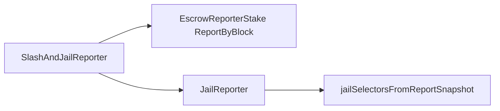

# ADR 1010: Deferred Reporter Switch and Dispute Jail Hardening

## Authors

@CJPotter10

## Changelog

- 2026-05-20: initial version (v6.2.0)

## Context

On **main**, `MsgSwitchReporter` updates `Selection.reporter` immediately and, when the outgoing reporter had reporting history, sets `Selection.locked_until_time` to roughly unbonding duration (~21 days) so the selector’s stake is excluded everywhere for that wall-clock period.

On v6.2.0:

1. **Reporter switch** is deferred: stake leaves the outgoing reporter immediately, but `Selection.reporter` changes only after a block-height unlock derived from the oracle. No new 21-day `locked_until_time` is applied on switch.
2. **Dispute jail** locks every selector in the disputed report’s `ReportByBlock` snapshot (same source as slash), not only the `Reporters` row—so switching reporters cannot restore reporting power before unlock.

## Overview

```mermaid
flowchart TB
  subgraph oracle [Oracle — on each SubmitValue]
    B[bumpMaxOpenCommitmentForReporter]
    M[MaxOpenCommitmentByReporter]
    B --> M
  end
  subgraph reporter [Reporter — on SwitchReporter]
    G[GetMaxOpenCommitmentForReporter]
    P[scheduleReporterSwitch]
    G --> P
    M -.->|O(1) read| G
  end
  subgraph finalize [Reporter — on ReporterStake]
    A[applyReadyPendingSwitchesForReporter]
    F[finalizePendingSwitch]
    A --> F
  end
  P --> finalize
```

## 1. Deferred reporter switch

### 1.1 State (reporter keeper)

| Collection | Key | Value |
|------------|-----|--------|
| `OutgoingPendingSwitches` | `(outgoing_reporter, selector)` | `PendingSwitchEntry { to_reporter, unlock_block }` |
| `IncomingPendingSwitchIdx` | `(incoming_reporter, selector)` | outgoing reporter address |
| `ReporterPendingSwitchHeads` | `reporter` | outgoing/incoming counts + min `unlock_block` (one Get before scanning) |

`Selection` fields used by this feature:

| Field | Role |
|-------|------|
| `reporter` | Active reporter for indexing; unchanged until finalize |
| `switch_out_locked_until_block` | Copy of scheduled `unlock_block`; blocks starting another switch while `>=` current height |
| `locked_until_time` | Still enforced in `GetReporterStake` for existing rows; **not** set on new switches |

Param `max_pending_switches_per_reporter` (default 10) limits pending rows per outgoing and per incoming reporter.

### 1.2 Oracle: `MaxOpenCommitmentByReporter`

**Store:** `x/oracle` — `MaxOpenCommitmentByReporter` maps `reporter address → uint64` (max `query.Expiration` block height seen on submit).

**On each successful `MsgSubmitValue`** (`submit_value.go`):

```go
k.bumpMaxOpenCommitmentForReporter(ctx, reporter.Bytes(), query.Expiration)
```

One map Get; Set only if the new expiration is higher than the stored value. No scan of open queries.

**On `scheduleReporterSwitch`** (reporter keeper):

```go
unlockBlock, err := k.oracleKeeper.GetMaxOpenCommitmentForReporter(ctx, prevReporter.Bytes())
```

One map Get; missing key → `0`. That height is stored as `unlock_block` on the pending row and `switch_out_locked_until_block` on `Selection`. The value is fixed at schedule time for that pending row.

| Value at schedule | When switch can finalize (`height > unlock_block`) |
|-------------------|-----------------------------------------------------|
| `0` | Next `ReporterStake` involving outgoing or incoming reporter |
| `H > height` | After chain height passes `H` |
| `H <= height` | Next `ReporterStake` (already eligible) |

The map is **monotonic** (never decreases). Unlock may be later than the true latest open expiration if an older, higher expiration was recorded earlier.

**Reporter → oracle API:** `GetMaxOpenCommitmentForReporter` only (`expected_keepers.go`).

### 1.3 `MsgSwitchReporter` flow

1. Validations (min stake, max selectors, reporter exists, not already on target).
2. If self-reporter demoting: optional `copyReporterJailToSelection`, then `Reporters.Remove`.
3. If outgoing pending to **same** target already exists → success (no-op).
4. If no outgoing pending: reject when `switch_out_locked_until_block >= current height` (handoff in progress).
5. `FlagStakeRecalc(outgoing)`.
6. `scheduleReporterSwitch` → pending maps + head index + `switch_out_locked_until_block`.
7. `FlagStakeRecalc(incoming)`.

Self-reporter with other selectors still requires **21 days since last oracle report** before switching away (unchanged gate; uses `GetLastReportedAtTimestamp`, not switch pending logic).

### 1.4 Stake vs identity

| Phase | `Selection.reporter` | Counted toward outgoing | Counted toward incoming |
|-------|----------------------|-------------------------|-------------------------|
| After switch tx | Outgoing (A) | No (outgoing pending skip) | No |
| After `height > unlock_block` + finalize | Incoming (B) | N/A | Yes |

`GetReporterStake` skips a selector when:

- Outgoing pending exists for `(this_reporter, selector)` and `selector.Reporter` still equals outgoing, or
- `SelectorStakeLocked(selector, now)` (dispute jail; see §2).

### 1.5 Finalization

`ReporterStake(rep)` (called from oracle `SubmitValue` and other stake paths) runs **`applyReadyPendingSwitchesForReporter`** first:

1. Load `ReporterPendingSwitchHeads[rep]`; exit if `height` is not past both min unlocks that matter.
2. For outgoing side: finalize rows with `unlock_block < height`.
3. For incoming side: same via `IncomingPendingSwitchIdx` → outgoing key.
4. `finalizePendingSwitch`: set `Selection.reporter` to target, clear `switch_out_locked_until_block`, remove pending keys, refresh heads, `FlagStakeRecalc` both reporters.

No BeginBlocker for switches. Condition is strict: `unlock_block < height` (so `unlock_block == height` finalizes on the next height).

```mermaid
sequenceDiagram
  participant S as Selector
  participant R as ReporterKeeper
  participant O as Oracle

  S->>R: MsgSwitchReporter A → B
  R->>O: GetMaxOpenCommitmentForReporter(A)
  R->>R: scheduleReporterSwitch
  Note over R: Stake excluded from A; reporter field still A

  Note over O: MsgSubmitValue on B or A
  O->>R: ReporterStake
  R->>R: applyReadyPendingSwitches if height > unlock_block
  Note over R: Selection.reporter = B; stake counts on B
```

## 2. Dispute jail hardening

### 2.1 `SlashAndJailReporter` → `JailReporter`

Dispute calls `JailReporter(ctx, reporterAddr, jailDuration, report.BlockNumber)`.

`JailReporter`:

1. If reporter row exists: set `Jailed`, `JailedUntil`.
2. `jailSelectorsFromReportSnapshot(reporter, reportBlockNumber, until)` — iterates `GetDelegationsAmount` / **`ReportByBlock`** at the report block, not the live `Selectors.Indexes.Reporter` index.

For each delegator in the snapshot: `lockSelectorRow` sets `LockedUntilTime` and `Jailed` / `JailedUntil` to `max(existing, until)`.

### 2.2 `Selection` jail fields (proto)

- `jailed` / `jailed_until` — dispute status and queries.
- `locked_until_time` — stake exclusion (also used on jail).

`SelectorStakeLocked(sel, now)` (`types/selection_lock.go`):

- `locked_until_time > now`, or
- `jailed && now < jailed_until`

Used in `GetReporterStake`, dispute vote power (`vote.go`), and lazy expiry when reading selectors.

`SwitchReporter` is **not** rejected for jailed selectors; they simply do not add power on any reporter until unlock.

### 2.3 Self-reporter demotion

Before `Reporters.Remove` on self-switch, if the reporter row is jailed, `copyReporterJailToSelection` copies jail times onto the selector’s `Selection` so penalties persist after the reporter row is removed.

### 2.4 Unjail and failed dispute

- **`UnjailReporter`**: clears expired jail on reporter row and/or that address’s `Selection`; clears active `locked_until_time` on selection unjail.
- **`UpdateJailedUntilOnFailedDispute(reporter, reportBlockNumber)`**: shortens reporter jail if needed; `clearSelectorLocksFromReportSnapshot` for the same `ReportByBlock` delegator set as jail.



## 3. Invariants

1. One outgoing pending row per `(outgoing, selector)`; switching to the same pending target is idempotent.
2. Outgoing stake never includes selectors with an outgoing pending row for that reporter.
3. Incoming stake never includes a selector until finalize updates `Selection.reporter`.
4. Dispute slash, jail, and failed-dispute unlock use the same `ReportByBlock` delegator set at `report.BlockNumber`.
5. `unlock_block` for a pending switch is the oracle max-commitment read at schedule time.

## 4. Upgrade

v6.2.0 (`app/upgrades/v6.2.0/`): module migrations; new collections and proto fields default empty/zero.

## 5. Implementation map

| Area | Path |
|------|------|
| Pending switch | `x/reporter/keeper/pending_switch.go` |
| Switch / create reporter msgs | `x/reporter/keeper/msg_server.go` |
| Stake + finalize entry | `x/reporter/keeper/reporter.go` |
| Jail / unjail | `x/reporter/keeper/jail.go` |
| Stake lock helper | `x/reporter/types/selection_lock.go` |
| Oracle max commitment | `x/oracle/keeper/max_open_commitment.go`, `submit_value.go` |
| Dispute slash/jail | `x/dispute/keeper/dispute.go`, `execute.go` |
| Proto | `proto/layer/reporter/selection.proto`, `params.proto` |

## 6. Operational notes

- **Monotonic max commitment** can defer switches longer than the live set of open queries strictly requires.
- **Self-reporter with other selectors** still has the 21-day-since-last-report gate when delegating to another reporter.
- Legacy `locked_until_time` on selections from pre-upgrade switches continues to exclude stake until it expires.
