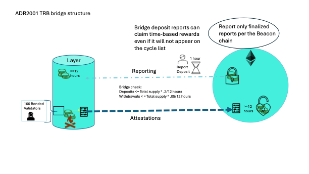

# ADR 2001: TRB bridge structure
## Authors

@themandalore
@brendaloya
@tkernell

## Changelog

- 2024-03-28: initial version
- 2024-04-01: revised for more discussion and align with data spec
- 2024-08-12: spelling
- 2024-08-20: added the claim deposit tip

- 2024-08-29: add separate withdraw and deposit limits and minimum deposit amount
## Context

Tellor Tributes (TRB) is the tellor token. It exists on Ethereum and cannot be changed. It mints ~4k to the team each month and ~4k to the oracle contract for time based inflationary rewards (tbr). When starting Layer we will launch a bridging contract where parties can deposit TRB to Layer. Layer will utilize reporters then to report deposit events to itself.  When the deposit is made it will be assigned a deposit ID and an event will be kicked off. All reporters will report for that event for a 1 hour window (this is allowed so that reporters are able to wait a certain amount of blocks before reporting so that the state of Ethereum has reached a high level of finality) and then we will optimistically use the report in our system, ensuring that the report is at least 12 hours old before the tokens are minted on Layer. Once the value is 12 hours old anyone can mint the tokens on Layer for the specified deposit ID.  

Claiming the deposit on Layer costs gas. A party bridging TRB to Layer for the first time will not have TRB available on Layer to pay the required gas fee to claim the deposit. This is problematic because it creates a whitelisting environment (only those with TRB balances on the chain and whoever they are willing to call the claim function for can participate on the chain). To avoid this, when depositing to the bridge a 'claim tip' for anyone that calls the claim deposit function for on Layer can be included (not required). 

 

As an additional security measure, the bridge contract will not allow more than 20% of the total supply on Layer to be bridged to Layer within a 12 hour period (the function will be locked). This will be to ensure that someone does not bridge over a very large amount to stake/grief the network, manipulate votes, or grief the system via disputes without proper time to analyze the situation. The bridge contract also enforces a minimum deposit amount of 0.1 TRB to prevent spamming the bridge with small deposits. For the reverse direction, parties will burn TRB on Layer, the validators will then attest that it happened and then the bridge contract on Ethereum can use the tellor data as any other user, but this time reading burn events. A 5% withdraw limit per 12 hours is used in this direction and the bridge contract will also use the data optimistically (12 hours old) to further reduce attack vectors.  The 5% withdraw limit mitigates the worst case scenario where a supermajority of the reporter set is compromised, allowing time to react and coordinate a social fork.

The cycle list helps keep the network alive by providing a list of data requests that reporters can support to receive time-based rewards(inflationary rewards) when there are no tips available to claim. Each data request on the cycle list rotates over time so that each request gets pushed on chain on a regular basis. The bridge deposit data request will not appear in the "next request" of the cycle list, however reporters will be allowed to report for it and claim time based rewards for it. Time based rewards will be split between the data request on the cycle list and the bridged deposit request. Parties can also use the tip functionality to incentivize faster updates for deposits. 

 

## Alternative Approaches

### Validators run the bridge

Rather than reporters, we could simply have validators natively run the bridge. This option would work fine and projects like Celer/gravity bridge already have implementations written. The reason we're going against it is twofold: a) finality issues with Ethereum make this inherently risky for any bridge and b) we should be dogfooding our own product.  There's no reason you can't use tellor as a bridge, so we should do so. Having validators the run bridge and submit would also require us to write a different bridge structure for the return trip. 

### Don't add bridge deposits as part of the cycle list

Forcing parties to report for the bridge might not be feasible when there are no deposit events, finality is not always constant, and could force unnecessary updates. For this reason we went with a longer time frame for submission (1 hour per event). This can still work with the cycle, but represents using the cycle list in a unique way.  

### Don't use optimistically, just use if consensus hit

The reason we want to use it optimistically here is for chain rollbacks. Although it's unlikely to happen and validator set changes are limited by percent, you could still pretend to deposit a bunch, roll back the chain, and then double spend or dispute on our chain with unlocked tokens. Since there is no immediate need for trb to be bridged, we will simply make it take 12 hours and then even limit the amount bridged over. 

### Allow a reporter tip to be included along with the deposit on Ethereum

It was considered to allow depositors to include a tip to incentivize reporters to bridge over the data faster to Layer. However, the process for verifying the data was reported to Layer and reporting back the reporters to Ethereum to claim the tip would be inefficient, make the process more complex, and require more storage to track the tips than tipping and distributing tips on Layer. 

### Don't allow a claimDeposit tip with the deposit on Ethereum

It was considered to not allow depositors to include a tip to incentivize running the claim deposit function on Layer. However, that would mean the new Layer participants have to depend on the team or other validators to 'admit' them by running the claim deposit function for them and inadvertently allowing for censoring participation.

### Make the claimDeposit function free on Layer

We considered allowing the claimDeposit function to be free but we didn't want the transaction to be used to spam Layer with microdeposits as Ethereum transactions fee continue to decrease.

## Issues / Notes on Implementation

Note that governance can change the queryId *time frame* and it should be monitored to make sure that commit times are enough notice on a given tip. 

In the case of a broken validator set (a completely compromised layer chain (>2/3 malicious)), a social fork will be necessary to save layer. Users will be aware of this and will be able to handle a failure, however in this case the bridge is the "user" of layer with regards to releasing tokens. We had looked into adding some sort of pause or schelling game to fork the bridge contract, however these solutions seem more like attack vectors than options. Ultimately, the TRB token will be used on layer. The only reason it will be on Ethereum is for legacy trading and CEX integrations (once legacy users are moved to layer). This is fine (these users and CEX contracts should never be forced to upgrade to cosmos if possible), however there is no real "break" of the system.  Ultimately if you take over our validator set, you will get forked out and lose the tokens. The trading venues and exchanges will need to monitor and freeze the trading should this occur. Although extreme, this is preferable to introducing an attack or censorship vector (e.g. a multisig to freeze the contracts) that would require a fork anyway, but would also not require the attacker to actually buy up tokens to hit 2/3 of the layer validator set. Ultimately, limiting the token withdrawals to a certain percentage per day is the best option to give trading venues time to halt in the case of an attack.  

