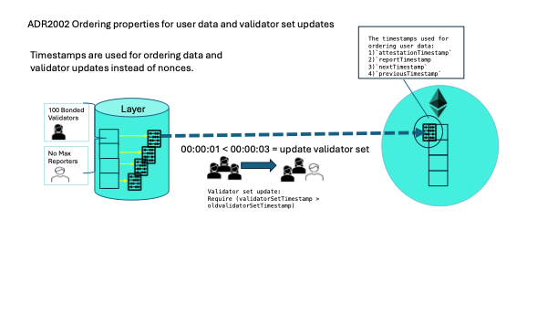

# ADR 2002: Ordering properties for user data and validator set updates

## Authors

@themandalore
@tkernell
@brendaloya

## Changelog

- 2024-02-21: initial version
- 2024-02-26: unbonding period 
- 2024-04-04: clarity in background
- 2024-08-05: clean up
- 2025-04-07: last consensus timestamp

## Context

Nonces generally help keep track of the order that data is added and the validator updates happen on cosmos chains.
While blobstream has used nonces to track the order of these important pieces, in Layer we have opted to use timestamps, as described below, for oracle data attestations and validator set changes. Strict rules are applied for for the validator set updates (ADR 2005) but the user can determine what data to use for their use case based on the timestamps provided. 

User data attestations - Each piece of data has 5 timestamps associated with it: 1) `attestationTimestamp`, 2)`reportTimestamp`, 3)`nextTimestamp`, 4)`previousTimestamp`, 5)`lastConsensusTimestamp`. 

Validator updates - Each time the validator set is updated there is a new `validatorSetTimestamp`. This prevents the validator set from being updated to an old set by requiring that the timstamp always increases with each update.

 
### Data attestations

Keeping track of the order of user data is important for Layer because allowing users to request old data can create optionality in the data used in their protocols (e.g. allowing users to request old price data for their benefit instead of the latest available). When users request an attestation for data the `attestationTimestamp`,`reportTimestamp`,`nextTimestamp` (where this should be zero if it is the latest), `previousTimestamp` and `lastConsensusTimestamp` are provided to determine ordering properties of bridged user data. The attestation timestamp is used to verify there is not a stale attestation in place. This ensures that there have been no disputes and no significant validator changes. 

Since users may not need every single oracle data point, providing the five different timestamps allows them to skip entries when needed (e.g. if we report prices 100, 101, and 102, a user on ETH could just bridge the 102 update and skip the other two). For those users who prioritize consensus data (data with 2/3 power), they can use the `lastConsensusTimestamp` to help their contracts determine whether the correct data is being used.
 
### Validator set changes

The order of the validator set updates is also very important because it helps maintain a list of validators that are still bonded and active. 

However, instead of a nonce, Layer includes a timestamp as one of the parameters used in bridge validator set updates. This is different than the original blobstream which also had a universal nonce. Each time the bridge validator set changes, all validators sign a hash of multiple parameters, including the new `validatorSetTimestamp`. The bridge contract enforces that this timestamp is greater than the previous one. The bridge contract also uses this timestamp to determine whether a given validator set record is stale by comparing the timestamp to the Layer unbonding period. We use the strictly increasing timestamp rule to prevent the bridge from accepting old validator set attestations, and it also allows the bridge to save gas costs by skipping blocks. 

In addition, we use the age of a validator set attestation to determine whether that validator set is the latest. This gives a higher confidence that the validators tokens are still locked as stakes and thus eligible for slashing. However, the amount of tokens available for slashing can change drastically due to disputes. This is why it is best practice for the user to request an attestation closer to the usage of the data. 

## Alternative Approaches

### Require a universal nonce for validator updates

We considered implementing a universal nonce but because that would mean that every time data is signed on layer it would need to be pushed across the bridge.  This is beneficial for DA systems (like Celestia's blobstream) since these need blocks to be processed in order.  If not, a situation could emerge where some data can front run other data and prevent it from being pushed. For our purposes, we only require that timestamps move forward in terms of the block signed. This means that some updates on layer can be skipped over (e.g. if we report prices 100, 101, and 102, a user on ETH could just bridge the 102 update and skip the other two). If a user wants to preserve the order of data pushed to Tellor, they can implement a nonce in the query and force it to increase per request.  

## Issues / Notes on Implementation

We considered using the unbonding period to determine if validator tokens are available for slashing (be staked until unbonded). Because the validator set can change significantly very quickly due to disputes and slashing events, comparing a validator set's age to the unbonding period does not ensure that a given validator still has tokens at stake.  If a bad value can make it though within that 21 day period then it is likely that the chain is compromised and a fork would be needed so instead we opted to provide the user with best practices for using the data.

## Links

https://github.com/celestiaorg/blobstream-contracts 

