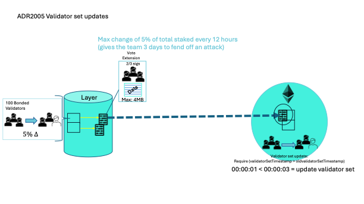

# ADR 2005: Validator set updates

## Authors

@brendaloya
@themandalore

## Changelog

- 2024-02-22: initial version
- 2024-04-01: used time to respond to an attack as a possible explanation

## Context

The validator set will be allowed to change up to 5% of total staked every 12 hours.  Setting the cap at 5% allows for 6, 12 hour periods(3 days) to pass before the validator set changes by 30%. Although, it may not deter all attacks, having to wait 3.5 days to take over the network for an attack can be enough deterrent. 

Based on talks with others that have used the cosmos sdk, changes larger than 5-10% are rarely observed once the new chain novelty passes and validators settle.
 

## Alternative Approaches

### Keep as high as possible
32% could be the highest allowed but it may not allow enough time to mitigate an attack. The higher it is the shorter the amount of time the community and users have to respond to a possible attack. 

### Keep smaller, or any change
It could be smaller, but what should be considered is the extra time needed vs the queue it could create.

## Issues / Notes on Implementation

